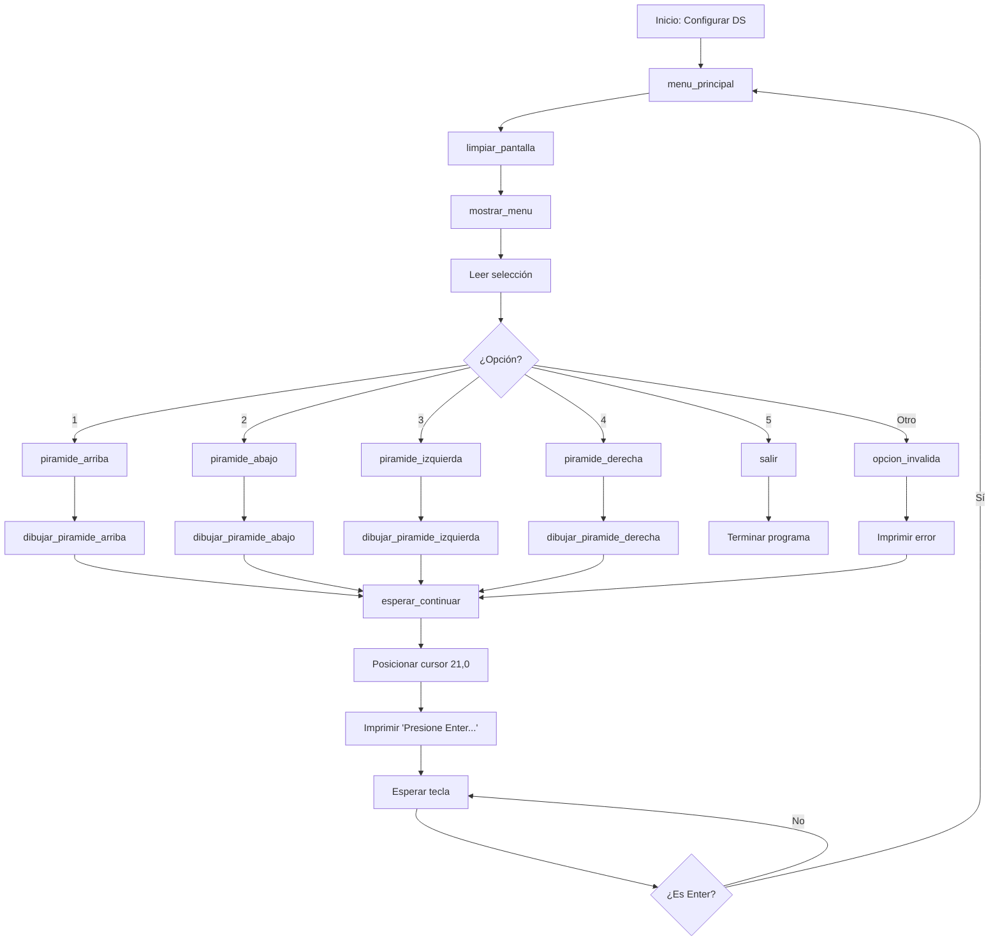

# Explicación Detallada del Código: Menú de Pirámides en Ensamblador

Este documento explica en detalle el funcionamiento del programa en ensamblador que implementa un menú interactivo para dibujar cuatro tipos de pirámides en la pantalla en modo texto de MS-DOS. El código utiliza macros, procedimientos, y técnicas de manipulación de pantalla para cumplir con los requisitos del proyecto. A continuación, se describe la estructura del programa, su flujo, las macros, los procedimientos, y cómo cada componente contribuye al resultado final. También se incluye un diagrama en Mermaid para visualizar el flujo del programa, preparando al lector para responder preguntas en una evaluación.

---

```assembly
.286
pila segment stack
    db 32 DUP('stack--')  ; Reserva 32 bytes para la pila
pila ends

datos segment
    ; Mensajes para el men?
    titulo db 13,10,'=== MENU DE PIRAMIDES ===','$'
    opcion1 db 13,10,'1. Piramide Normal (Hacia Arriba)','$'
    opcion2 db 13,10,'2. Piramide Hacia Abajo','$'
    opcion3 db 13,10,'3. Piramide Izquierda','$'
    opcion4 db 13,10,'4. Piramide Derecha','$'
    opcion5 db 13,10,'5. Salir','$'
    prompt db 13,10,'Seleccione una opcion (1-5): ','$'
    continuar db 'Presione Enter para continuar...','$'
    error db 13,10,'Opcion invalida, intente de nuevo.','$'
    salto_linea db 13,10,'$'
    seleccion db ?  ; Variable para almacenar la opci?n del usuario
    var dw ?        ; Variable para preservar CX
datos ends

codigo segment 'code'
    ; Macro para posicionar el cursor en la pantalla
    POSICIONAR_CURSOR MACRO fila, columna
        mov ah, 02h        ; Funci?n para posicionar cursor
        mov bh, 00h        ; P?gina de video 0
        mov dh, fila       ; Fila
        mov dl, columna    ; Columna
        int 10h            ; Interrupci?n de video
    ENDM

    ; Macro para imprimir un car?cter en la pantalla
    IMPRIMIR_CARACTER MACRO caracter, cantidad
        mov ah, 0Ah        ; Funci?n para escribir car?cter
        mov al, caracter   ; Car?cter a imprimir
        mov cx, cantidad   ; N?mero de veces a repetir
        int 10h            ; Interrupci?n de video
    ENDM

    main proc far
    assume ss:pila, ds:datos, cs:codigo
    
    ; Configurar segmento de datos
    push ds
    push 0
    mov ax, datos
    mov ds, ax
    
menu_principal:
    ; Limpiar pantalla
    call limpiar_pantalla
    
    ; Mostrar men?
    call mostrar_menu
    
    ; Leer opci?n del usuario
    mov ah, 01h        ; Funci?n para leer car?cter
    int 21h
    mov seleccion, al  ; Guardar opci?n
    
    ; Comparar opci?n y saltar al procedimiento correspondiente
    cmp seleccion, '1'
    je piramide_arriba
    cmp seleccion, '2'
    je piramide_abajo
    cmp seleccion, '3'
    je piramide_izquierda
    cmp seleccion, '4'
    je piramide_derecha
    cmp seleccion, '5'
    je salir
    jmp opcion_invalida
    
piramide_arriba:
    call dibujar_piramide_arriba
    jmp esperar_continuar
    
piramide_abajo:
    call dibujar_piramide_abajo
    jmp esperar_continuar
    
piramide_izquierda:
    call dibujar_piramide_izquierda
    jmp esperar_continuar
    
piramide_derecha:
    call dibujar_piramide_derecha
    jmp esperar_continuar
    
opcion_invalida:
    mov ah, 09h
    lea dx, error
    int 21h
    jmp esperar_continuar
    
esperar_continuar:
    ; Posicionar cursor en una fila segura para evitar sobreposici?n
    POSICIONAR_CURSOR 21, 0
    ; Mostrar mensaje de continuar
    mov ah, 09h
    lea dx, continuar
    int 21h
    
    ; Esperar Enter
    mov ah, 01h
    int 21h
    cmp al, 0Dh        ; Comparar con retorno de carro
    je menu_principal
    
salir:
    ; Terminar programa
    mov ax, 4C00h
    int 21h
    
    main endp
    
    ; Procedimiento para limpiar la pantalla
    limpiar_pantalla proc near
        mov ax, 0600h      ; Funci?n para desplazar pantalla (limpiar)
        mov bh, 4Fh        ; Atributo: BN:07h - BA:1fh - VN:02h - NV:20h
        mov cx, 0000h      ; Esquina superior izquierda
        mov dx, 184Fh      ; Esquina inferior derecha (24,79)
        int 10h
        POSICIONAR_CURSOR 0, 0  ; Reposicionar cursor
        ret
    limpiar_pantalla endp
    
    ; Procedimiento para mostrar el men?
    mostrar_menu proc near
        mov ah, 09h        ; Funci?n para imprimir cadena
        lea dx, titulo
        int 21h
        lea dx, opcion1
        int 21h
        lea dx, opcion2
        int 21h
        lea dx, opcion3
        int 21h
        lea dx, opcion4
        int 21h
        lea dx, opcion5
        int 21h
        lea dx, prompt
        int 21h
        ret
    mostrar_menu endp
    
    ; Procedimiento para dibujar pir?mide hacia arriba
    dibujar_piramide_arriba proc near
        call limpiar_pantalla
        mov cx, 20         ; N?mero de filas
        mov dh, 19         ; Fila inicial (abajo)
        mov dl, 12         ; Columna inicial
        mov bx, 39         ; Cantidad inicial de asteriscos
    ciclo_arriba:
        POSICIONAR_CURSOR dh, dl
        IMPRIMIR_CARACTER '*', bx
        add dl, 1          ; Mover columna a la derecha
        sub dh, 1          ; Subir una fila
        sub bx, 2          ; Reducir asteriscos
        loop ciclo_arriba
        ret
    dibujar_piramide_arriba endp
    
    ; Procedimiento para dibujar pir?mide hacia abajo
    dibujar_piramide_abajo proc near
        call limpiar_pantalla
        mov cx, 20         ; N?mero de filas
        mov dh, 0          ; Fila inicial (arriba)
        mov dl, 12         ; Columna inicial
        mov bx, 39         ; Cantidad inicial de asteriscos
    ciclo_abajo:
        POSICIONAR_CURSOR dh, dl
        IMPRIMIR_CARACTER '*', bx
        add dl, 1          ; Mover columna a la derecha
        add dh, 1          ; Bajar una fila
        sub bx, 2          ; Reducir asteriscos
        loop ciclo_abajo
        ret
    dibujar_piramide_abajo endp
    
    ; Procedimiento para dibujar pir?mide izquierda
    dibujar_piramide_izquierda proc near
        call limpiar_pantalla
        mov cx, 10         ; Primer ciclo: crecimiento
        mov dh, 0          ; Fila inicial
        mov dl, 22         ; Columna inicial (16h = 22)
        mov bx, 1          ; Cantidad inicial de asteriscos
    ciclo_izq1:
        mov var, cx        ; Preservar CX
        POSICIONAR_CURSOR dh, dl
        IMPRIMIR_CARACTER '*', bx
        mov cx, var        ; Restaurar CX
        sub dl, 1          ; Mover columna a la izquierda
        add dh, 1          ; Bajar una fila
        add bx, 1          ; Aumentar asteriscos
        loop ciclo_izq1
        mov cx, 10         ; Segundo ciclo: decrecimiento
        mov dl, 14         ; Nueva columna inicial (0Bh + 03h = 14)
        sub bx, 2          ; Ajustar asteriscos
    ciclo_izq2:
        mov var, cx        ; Preservar CX
        POSICIONAR_CURSOR dh, dl
        IMPRIMIR_CARACTER '*', bx
        mov cx, var        ; Restaurar CX
        add dl, 1          ; Mover columna a la derecha
        add dh, 1          ; Bajar una fila
        sub bx, 1          ; Reducir asteriscos
        loop ciclo_izq2
        ret
    dibujar_piramide_izquierda endp
    
    ; Procedimiento para dibujar pir?mide derecha
    dibujar_piramide_derecha proc near
        call limpiar_pantalla
        mov cx, 10         ; Primer ciclo: crecimiento
        mov dh, 0          ; Fila inicial
        mov dl, 10         ; Columna inicial (0Ah = 10)
        mov bx, 1          ; Cantidad inicial de asteriscos
    ciclo_der1:
        mov var, cx        ; Preservar CX
        POSICIONAR_CURSOR dh, dl
        IMPRIMIR_CARACTER '*', bx
        mov cx, var        ; Restaurar CX
        add dh, 1          ; Bajar una fila
        add bx, 1          ; Aumentar asteriscos
        loop ciclo_der1
        mov cx, 10         ; Segundo ciclo: decrecimiento
        mov dl, 10         ; Mantener columna inicial
        sub bx, 2          ; Ajustar asteriscos
    ciclo_der2:
        mov var, cx        ; Preservar CX
        POSICIONAR_CURSOR dh, dl
        IMPRIMIR_CARACTER '*', bx
        mov cx, var        ; Restaurar CX
        add dh, 1          ; Bajar una fila
        sub bx, 1          ; Reducir asteriscos
        loop ciclo_der2
        ret
    dibujar_piramide_derecha endp
    
codigo ends
end main
```

## 1. Introducción al Código

El programa es un ejemplo de programación en ensamblador para MS-DOS que presenta un menú con cinco opciones:
1. Pirámide Normal (hacia arriba).
2. Pirámide Hacia Abajo.
3. Pirámide Izquierda.
4. Pirámide Derecha.
5. Salir.

El usuario selecciona una opción (1-5), y el programa dibuja la pirámide correspondiente usando asteriscos (`*`) en la pantalla en modo texto (80x25 caracteres). Después de dibujar una pirámide, muestra un mensaje para continuar, espera la tecla Enter, y regresa al menú. Si la opción es inválida, muestra un mensaje de error. La opción 5 termina el programa.

El código utiliza:
- **Macros**: Para tareas repetitivas como posicionar el cursor e imprimir caracteres.
- **Procedimientos**: Para modularizar funciones como limpiar la pantalla, mostrar el menú, y dibujar cada pirámide.
- **Interrupciones**: Para interactuar con el hardware (pantalla y teclado).
- **Segmentos**: Para organizar la pila, los datos, y el código.

---

## 2. Estructura del Código

El programa está organizado en tres segmentos principales:

### 2.1. Segmento de Pila (`pila`)
```assembly
pila segment stack
    db 32 DUP('stack--')  ; Reserva 32 bytes para la pila
pila ends
```
- **Propósito**: Define el espacio para la pila, que almacena direcciones de retorno, variables temporales, y registros durante las llamadas a procedimientos.
- **Detalles**:
  - Reserva 32 bytes usando `DUP` (duplicar) con la cadena `'stack--'`.
  - La pila es esencial para las operaciones `push`, `pop`, y las llamadas a procedimientos (`call`).

### 2.2. Segmento de Datos (`datos`)
```assembly
datos segment
    titulo db 13,10,'=== MENU DE PIRAMIDES ===','$'
    opcion1 db 13,10,'1. Piramide Normal (Hacia Arriba)','$'
    opcion2 db 13,10,'2. Piramide Hacia Abajo','$'
    opcion3 db 13,10,'3. Piramide Izquierda','$'
    opcion4 db 13,10,'4. Piramide Derecha','$'
    opcion5 db 13,10,'5. Salir','$'
    prompt db 13,10,'Seleccione una opcion (1-5): ','$'
    continuar db 'Presione Enter para continuar...','$'
    error db 13,10,'Opcion invalida, intente de nuevo.','$'
    salto_linea db 13,10,'$'
    seleccion db ?  ; Variable para almacenar la opción del usuario
    var dw ?        ; Variable para preservar CX
datos ends
```
- **Propósito**: Almacena cadenas de texto y variables usadas por el programa.
- **Detalles**:
  - **Cadenas**: Usan códigos ASCII, terminadas con `'$'` para la interrupción `21h` (impresión de cadenas). Los valores `13,10` (retorno de carro y salto de línea) aseguran formato adecuado en pantalla.
  - **Variables**:
    - `seleccion db ?`: Almacena el carácter ingresado por el usuario (1-5).
    - `var dw ?`: Preserva el valor del registro `CX` en los bucles de las pirámides izquierda y derecha para evitar sobrescritura.
  - Cada cadena corresponde a un elemento del menú, mensajes de error, o prompts.

### 2.3. Segmento de Código (`codigo`)
- Contiene el código ejecutable, incluyendo macros, procedimientos, y el procedimiento principal (`main`).
- Define dos macros y cinco procedimientos, descritos más adelante.

---

## 3. Macros

Las macros son fragmentos de código reutilizables que simplifican tareas repetitivas, evitando la repetición de instrucciones.

### 3.1. `POSICIONAR_CURSOR`
```assembly
POSICIONAR_CURSOR MACRO fila, columna
    mov ah, 02h        ; Función para posicionar cursor
    mov bh, 00h        ; Página de video 0
    mov dh, fila       ; Fila
    mov dl, columna    ; Columna
    int 10h            ; Interrupción de video
ENDM
```
- **Propósito**: Mueve el cursor a una posición específica en la pantalla (coordenadas `fila`, `columna`).
- **Funcionamiento**:
  - Usa la interrupción `10h` (servicios de video) con la función `02h` (posicionar cursor).
  - `BH = 00h`: Selecciona la página de video 0 (predeterminada en modo texto).
  - `DH`: Fila (0-24 en modo texto 80x25).
  - `DL`: Columna (0-79).
  - Ejecuta `int 10h` para aplicar el cambio.
- **Ejemplo de uso**: `POSICIONAR_CURSOR 21, 0` coloca el cursor en la fila 21, columna 0 para el mensaje de continuar.

### 3.2. `IMPRIMIR_CARACTER`
```assembly
IMPRIMIR_CARACTER MACRO caracter, cantidad
    mov ah, 0Ah        ; Función para escribir carácter
    mov al, caracter   ; Carácter a imprimir
    mov cx, cantidad   ; Número de veces a repetir
    int 10h            ; Interrupción de video
ENDM
```
- **Propósito**: Imprime un carácter (por ejemplo, `*`) un número especificado de veces en la posición actual del cursor.
- **Funcionamiento**:
  - Usa la interrupción `10h` con la función `0Ah` (escribir carácter sin mover el cursor).
  - `AL`: Carácter a imprimir (por ejemplo, `'*'` = `42h`).
  - `CX`: Número de repeticiones.
  - Ejecuta `int 10h` para dibujar los caracteres.
- **Ejemplo de uso**: `IMPRIMIR_CARACTER '*', 5` imprime `*****`.
- **Nota**: Esta macro modifica `CX`, por lo que en las pirámides izquierda y derecha se preserva `CX` usando la variable `var`.

---

## 4. Procedimientos

Los procedimientos modularizan el código, encapsulando funciones específicas. El programa define cinco procedimientos:

### 4.1. `limpiar_pantalla`
```assembly
limpiar_pantalla proc near
    mov ax, 0600h      ; Función para desplazar pantalla (limpiar)
    mov bh, 07h        ; Atributo: blanco sobre negro
    mov cx, 0000h      ; Esquina superior izquierda
    mov dx, 184Fh      ; Esquina inferior derecha (24,79)
    int 10h
    POSICIONAR_CURSOR 0, 0  ; Reposicionar cursor
    ret
limpiar_pantalla endp
```
- **Propósito**: Limpia la pantalla y reposiciona el cursor en la esquina superior izquierda (0,0).
- **Funcionamiento**:
  - Usa `int 10h` con `AX = 0600h` para desplazar (limpiar) la pantalla.
  - `BH = 07h`: Establece el atributo de color (blanco sobre negro).
  - `CX = 0000h`: Coordenadas de la esquina superior izquierda (fila 0, columna 0).
  - `DX = 184Fh`: Coordenadas de la esquina inferior derecha (fila 24, columna 79).
  - Llama a `POSICIONAR_CURSOR` para mover el cursor a (0,0).
- **Uso**: Se ejecuta antes de mostrar el menú o dibujar una pirámide para asegurar una pantalla limpia.

### 4.2. `mostrar_menu`
```assembly
mostrar_menu proc near
    mov ah, 09h        ; Función para imprimir cadena
    lea dx, titulo
    int 21h
    lea dx, opcion1
    int 21h
    lea dx, opcion2
    int 21h
    lea dx, opcion3
    int 21h
    lea dx, opcion4
    int 21h
    lea dx, opcion5
    int 21h
    lea dx, prompt
    int 21h
    ret
mostrar_menu endp
```
- **Propósito**: Imprime el menú con las opciones y el prompt para la selección del usuario.
- **Funcionamiento**:
  - Usa `int 21h` con `AH = 09h` para imprimir cadenas terminadas en `'$'`.
  - `LEA DX, cadena`: Carga la dirección de cada cadena (`titulo`, `opcion1`, ..., `prompt`) en `DX`.
  - Ejecuta `int 21h` para cada cadena, mostrando el menú en pantalla.
- **Salida**:
  ```
  === MENU DE PIRAMIDES ===
  1. Piramide Normal (Hacia Arriba)
  2. Piramide Hacia Abajo
  3. Piramide Izquierda
  4. Piramide Derecha
  5. Salir
  Seleccione una opcion (1-5):
  ```

### 4.3. `dibujar_piramide_arriba`

```assembly
dibujar_piramide_arriba proc near
    call limpiar_pantalla
    mov cx, 20         ; Número de filas
    mov dh, 19         ; Fila inicial (abajo)
    mov dl, 12         ; Columna inicial
    mov bx, 39         ; Cantidad inicial de asteriscos
ciclo_arriba:
    POSICIONAR_CURSOR dh, dl
    IMPRIMIR_CARACTER '*', bx
    add dl, 1          ; Mover columna a la derecha
    sub dh, 1          ; Subir una fila
    sub bx, 2          ; Reducir asteriscos
    loop ciclo_arriba
    ret
dibujar_piramide_arriba endp
```
- **Propósito**: Dibuja una pirámide con la base en la parte inferior (hacia arriba).
- **Funcionamiento**:
  - Llama a `limpiar_pantalla` para empezar con una pantalla limpia.
  - Inicializa:
    - `CX = 20`: 20 iteraciones (filas).
    - `DH = 19`: Comienza en la fila 19 (cerca del fondo).
    - `DL = 12`: Comienza en la columna 12.
    - `BX = 39`: Imprime 39 asteriscos en la primera fila.
  - En cada iteración:
    - Posiciona el cursor con `POSICIONAR_CURSOR`.
    - Imprime `BX` asteriscos con `IMPRIMIR_CARACTER`.
    - Mueve el cursor a la derecha (`add dl, 1`), sube una fila (`sub dh, 1`), y reduce el número de asteriscos en 2 (`sub bx, 2`).
    - Usa `loop` para repetir hasta que `CX = 0`.
- **Salida visual** (aproximada):
  ```
               *
              ***
             *****
            *******
           *********
          ***********
         *************
        ***************
       *****************
      *******************
      ...
  ```

### 4.4. `dibujar_piramide_abajo`
```assembly
dibujar_piramide_abajo proc near
    call limpiar_pantalla
    mov cx, 20         ; Número de filas
    mov dh, 0          ; Fila inicial (arriba)
    mov dl, 12         ; Columna inicial
    mov bx, 39         ; Cantidad inicial de asteriscos
ciclo_abajo:
    POSICIONAR_CURSOR dh, dl
    IMPRIMIR_CARACTER '*', bx
    add dl, 1          ; Mover columna a la derecha
    add dh, 1          ; Bajar una fila
    sub bx, 2          ; Reducir asteriscos
    loop ciclo_abajo
    ret
dibujar_piramide_abajo endp
```
- **Propósito**: Dibuja una pirámide con la base en la parte superior (hacia abajo).
- **Funcionamiento**:
  - Similar a `dibujar_piramide_arriba`, pero:
    - Comienza en la fila 0 (`DH = 0`).
    - Baja una fila en cada iteración (`add dh, 1`) en lugar de subir.
  - Los demás parámetros (`CX = 20`, `DL = 12`, `BX = 39`) y ajustes son idénticos.
- **Salida visual** (aproximada):
  ```
  ***************************************
   *************************************
    ***********************************
     *********************************
      *******************************
       *****************************
        ***************************
         *************************
          ***********************
           *********************
           ...
  ```

### 4.5. `dibujar_piramide_izquierda`
```assembly
dibujar_piramide_izquierda proc near
    call limpiar_pantalla
    mov cx, 10         ; Primer ciclo: crecimiento
    mov dh, 0          ; Fila inicial
    mov dl, 22         ; Columna inicial (16h = 22)
    mov bx, 1          ; Cantidad inicial de asteriscos
ciclo_izq1:
    mov var, cx        ; Preservar CX
    POSICIONAR_CURSOR dh, dl
    IMPRIMIR_CARACTER '*', bx
    mov cx, var        ; Restaurar CX
    sub dl, 1          ; Mover columna a la izquierda
    add dh, 1          ; Bajar una fila
    add bx, 1          ; Aumentar asteriscos
    loop ciclo_izq1
    mov cx, 10         ; Segundo ciclo: decrecimiento
    mov dl, 14         ; Nueva columna inicial (0Bh + 03h = 14)
    sub bx, 2          ; Ajustar asteriscos
ciclo_izq2:
    mov var, cx        ; Preservar CX
    POSICIONAR_CURSOR dh, dl
    IMPRIMIR_CARACTER '*', bx
    mov cx, var        ; Restaurar CX
    add dl, 1          ; Mover columna a la derecha
    add dh, 1          ; Bajar una fila
    sub bx, 1          ; Reducir asteriscos
    loop ciclo_izq2
    ret
dibujar_piramide_izquierda endp
```
- **Propósito**: Dibuja una pirámide que crece y luego decrece, alineada hacia la izquierda.
- **Funcionamiento**:
  - **Primer ciclo (crecimiento)**:
    - Inicializa: `CX = 10`, `DH = 0`, `DL = 22`, `BX = 1`.
    - Por iteración:
      - Guarda `CX` en `var` porque `IMPRIMIR_CARACTER` lo modifica.
      - Posiciona el cursor y dibuja `BX` asteriscos.
      - Restaura `CX` desde `var`.
      - Mueve el cursor a la izquierda (`sub dl, 1`), baja una fila (`add dh, 1`), y aumenta asteriscos (`add bx, 1`).
    - Resultado: Crece de 1 a 10 asteriscos, de la columna 22 a la 13, filas 0 a 9.
  - **Segundo ciclo (decrecimiento)**:
    - Inicializa: `CX = 10`, `DL = 14`, `BX = BX - 2` (9 asteriscos).
    - Por iteración:
      - Preserva y restaura `CX`.
      - Posiciona el cursor y dibuja `BX` asteriscos.
      - Mueve el cursor a la derecha (`add dl, 1`), baja una fila (`add dh, 1`), y reduce asteriscos (`sub bx, 1`).
    - Resultado: Decrece de 9 a 0 asteriscos, de la columna 14 a la 23, filas 10 a 19.
- **Salida visual** (aproximada):
  ```
        *    
       **   
      ***  
     **** 
    ***** 
   ****** 
  ******* 
 ******** 
********* 
********** 
 ********* 
  ******** 
   ******* 
    ****** 
     ***** 
      **** 
       *** 
        ** 
         * 
  ```

### 4.6. `dibujar_piramide_derecha`
```assembly
dibujar_piramide_derecha proc near
    call limpiar_pantalla
    mov cx, 10         ; Primer ciclo: crecimiento
    mov dh, 0          ; Fila inicial
    mov dl, 10         ; Columna inicial (0Ah = 10)
    mov bx, 1          ; Cantidad inicial de asteriscos
ciclo_der1:
    mov var, cx        ; Preservar CX
    POSICIONAR_CURSOR dh, dl
    IMPRIMIR_CARACTER '*', bx
    mov cx, var        ; Restaurar CX
    add dh, 1          ; Bajar una fila
    add bx, 1          ; Aumentar asteriscos
    loop ciclo_der1
    mov cx, 10         ; Segundo ciclo: decrecimiento
    mov dl, 10         ; Mantener columna inicial
    sub bx, 2          ; Ajustar asteriscos
ciclo_der2:
    mov var, cx        ; Preservar CX
    POSICIONAR_CURSOR dh, dl
    IMPRIMIR_CARACTER '*', bx
    mov cx, var        ; Restaurar CX
    add dh, 1          ; Bajar una fila
    sub bx, 1          ; Reducir asteriscos
    loop ciclo_der2
    ret
dibujar_piramide_derecha endp
```
- **Propósito**: Dibuja una pirámide que crece y luego decrece, alineada hacia la derecha.
- **Funcionamiento**:
  - **Primer ciclo (crecimiento)**:
    - Inicializa: `CX = 10`, `DH = 0`, `DL = 10`, `BX = 1`.
    - Por iteración:
      - Preserva y restaura `CX`.
      - Posiciona el cursor y dibuja `BX` asteriscos.
      - Baja una fila (`add dh, 1`), aumenta asteriscos (`add bx, 1`).
    - Resultado: Crece de 1 a 10 asteriscos, columna 10, filas 0 a 9.
  - **Segundo ciclo (decrecimiento)**:
    - Inicializa: `CX = 10`, `DL = 10`, `BX = BX - 2` (9 asteriscos).
    - Por iteración:
      - Preserva y restaura `CX`.
      - Posiciona el cursor y dibuja `BX` asteriscos.
      - Baja una fila (`add dh, 1`), reduce asteriscos (`sub bx, 1`).
    - Resultado: Decrece de 9 a 0 asteriscos, columna 10, filas 10 a 19.
- **Salida visual** (aproximada):
  ```
  *    
  **   
  ***  
  **** 
  ***** 
  ****** 
  ******* 
  ******** 
  ********* 
  ********** 
  ********* 
  ******** 
  ******* 
  ****** 
  ***** 
  **** 
  *** 
  ** 
  * 
  ```

---

## 5. Flujo del Programa

El flujo del programa se describe a continuación, seguido de un diagrama en Mermaid.

### 5.1. Descripción del Flujo
1. **Inicio (`main`)**:
   - Configura el segmento de datos (`push ds`, `push 0`, `mov ax, datos`, `mov ds, ax`) para que `DS` apunte al segmento `datos`.
2. **Menú Principal (`menu_principal`)**:
   - Llama a `limpiar_pantalla` para limpiar la pantalla.
   - Llama a `mostrar_menu` para mostrar el menú.
   - Lee un carácter del teclado (`int 21h`, `AH = 01h`) y lo guarda en `seleccion`.
   - Compara `seleccion` con `'1'` a `'5'` usando `cmp` y `je`:
     - `'1'`: Salta a `piramide_arriba`.
     - `'2'`: Salta a `piramide_abajo`.
     - `'3'`: Salta a `piramide_izquierda`.
     - `'4'`: Salta a `piramide_derecha`.
     - `'5'`: Salta a `salir`.
     - Otro: Salta a `opcion_invalida`.
3. **Dibujar Pirámides**:
   - Cada etiqueta (`piramide_arriba`, etc.) llama al procedimiento correspondiente y salta a `esperar_continuar`.
   - `opcion_invalida` imprime un mensaje de error y salta a `esperar_continuar`.
4. **Esperar Continuar (`esperar_continuar`)**:
   - Posiciona el cursor en la fila 21, columna 0.
   - Imprime "Presione Enter para continuar...".
   - Espera un carácter (`int 21h`, `AH = 01h`).
   - Si el carácter es Enter (`0Dh`), regresa a `menu_principal`.
5. **Salir (`salir`)**:
   - Termina el programa con `int 21h`, `AX = 4C00h`.

### 5.2. Diagrama en Mermaid


---

## 6. Detalles Técnicos

### 6.1. Interrupciones Usadas
- **INT 10h (Servicios de video)**:
  - `AH = 02h`: Posiciona el cursor (usado en `POSICIONAR_CURSOR`).
  - `AH = 06h`: Desplaza la pantalla para limpiar (usado en `limpiar_pantalla`).
  - `AH = 0Ah`: Escribe un carácter múltiples veces (usado en `IMPRIMIR_CARACTER`).
- **INT 21h (Servicios de DOS)**:
  - `AH = 01h`: Lee un carácter del teclado con eco.
  - `AH = 09h`: Imprime una cadena terminada en `'$'`.
  - `AH = 4Ch`: Termina el programa.

### 6.2. Preservación de `CX`
- En `dibujar_piramide_izquierda` y `dibujar_piramide_derecha`, la variable `var` preserva `CX` porque:
  - `IMPRIMIR_CARACTER` usa `CX` para la cantidad de asteriscos.
  - La instrucción `loop` depende de `CX` como contador del bucle.
  - Sin preservación, `CX` se sobrescribe, causando bucles erráticos.

### 6.3. Modo de Video
- El programa opera en modo texto 80x25 (modo 03h, configurado en los algoritmos originales pero implícito aquí).
- La pantalla tiene 80 columnas (0-79) y 25 filas (0-24), lo que define las coordenadas usadas.

---

## 7. Preguntas Potenciales para la Evaluación

Para prepararte, aquí hay preguntas que podrían hacerte y cómo responderlas:

1. **¿Qué hace la directiva `.286`?**
   - Respuesta: Indica que el programa usa instrucciones compatibles con el procesador 80286, permitiendo acceso a registros de 16 bits y ciertas instrucciones avanzadas.

2. **¿Para qué sirve el segmento de pila?**
   - Respuesta: Reserva espacio para la pila, que almacena direcciones de retorno, registros, y datos temporales durante las llamadas a procedimientos.

3. **¿Cuál es la diferencia entre una macro y un procedimiento?**
   - Respuesta: Una macro (`POSICIONAR_CURSOR`, `IMPRIMIR_CARACTER`) es un fragmento de código que se inserta en el lugar donde se invoca, simplificando tareas repetitivas. Un procedimiento (`limpiar_pantalla`, etc.) es una subrutina que se llama con `call` y retorna con `ret`, permitiendo reutilización y modularidad.

4. **¿Por qué se usa la variable `var` en las pirámides izquierda y derecha?**
   - Respuesta: Preserva el valor de `CX` (contador del bucle) porque `IMPRIMIR_CARACTER` lo modifica para especificar la cantidad de asteriscos. Sin `var`, el bucle `loop` fallaría.

5. **¿Cómo se asegura que el mensaje "Presione Enter..." no se sobreponga a las pirámides?**
   - Respuesta: Se usa `POSICIONAR_CURSOR 21, 0` en `esperar_continuar` para colocar el mensaje en la fila 21, fuera del área donde se dibujan las pirámides (filas 0-19).

6. **¿Qué hace la instrucción `loop`?**
   - Respuesta: Decrementa `CX` y salta a la etiqueta especificada si `CX != 0`, usada para controlar los bucles en los procedimientos de dibujo.

7. **¿Por qué se usa `int 21h` con `AH = 09h` en el menú?**
   - Respuesta: Imprime cadenas terminadas en `'$'` en la pantalla, como el título y las opciones del menú, de manera eficiente.

---

## 8. Conclusión

El programa es un ejemplo bien estructurado de programación en ensamblador que combina macros, procedimientos, e interrupciones para crear un menú interactivo y dibujar pirámides en modo texto. Su flujo es claro, con un bucle principal que maneja la entrada del usuario y delega tareas a procedimientos específicos. Las macros simplifican operaciones repetitivas, y los procedimientos modularizan la lógica. El diagrama en Mermaid y las explicaciones detalladas deberían ayudarte a entender y explicar el código en tu evaluación. Si necesitas más ejemplos, simulaciones, o práctica con preguntas, ¡avísame!
